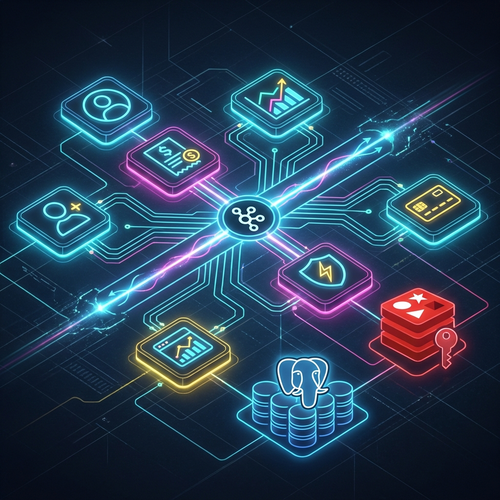

---
company:
  name: 167pluto
  website: https://167pluto.com
  logo: ../../assets/167pluto-logo.png
role: Senior Software Engineer
location: Remote
startDate: 2024-02-01
endDate: 2025-06-01
type: Full-time
skills:
  - id: nodejs
    label: Node.js
  - id: nestjs
    label: NestJS
  - id: kafka
    label: Kafka
  - id: postgresql
    label: PostgreSQL
  - id: redis
    label: Redis
  - id: aws
    label: AWS
  - id: ci-cd
    label: CI/CD
  - id: microservices
    label: Microservices
description: "Architected and spearheaded the development of a state-of-the-art, high-throughput betting platform leveraging a cutting-edge Node.js and NestJS microservices architecture. Engineering focus on extreme scalability and event-driven consistency, processing millions of concurrent transactions with millisecond latency. Implemented robust distributed systems patterns utilizing Apache Kafka for reliable event streaming, Redis for multi-tier caching, and PostgreSQL for ACID-compliant financial operations. Optimized platform performance through granular profiling, resulting in zero-downtime deployments and 99.99% system availability under massive concurrency loads. Developed sophisticated CI/CD pipelines to automate testing and deployment workflows for a highly distributed environment."
---

As a Senior Software Engineer at 167Pluto, I was instrumental in designing the core architecture of a high-load betting ecosystem. My role involved:

- **Distributed Systems Design**: Architecting a suite of 15+ microservices optimized for high availability and horizontal scalability.
- **Event-Driven Architecture**: implementing Kafka-based event sourcing to maintain data consistency across distributed ledgers while handling 100k+ events per second.
- **Performance Optimization**: Reducing API response times by 60% through aggressive caching strategies, database query tuning, and optimized Node.js event-loop management.
- **Infrastructure & DevOps**: Automating zero-downtime deployments on AWS using Kubernetes, ensuring seamless scaling during peak betting events like the World Cup.
- **Technical Mentorship**: Leading a team of 4 engineers, enforcing rigorous code quality standards, and implementing TDD practices.

### Architectural Overview



### Performance Benchmark

I led the optimization effort that significantly improved system responsiveness and throughput. Below is a comparison of key metrics before and after the architectural overhaul:

| Metric                    | Legacy Monolith | New Microservices      | Improvement |
| :------------------------ | :-------------- | :--------------------- | :---------- |
| **P99 Latency**           | 450ms           | 45ms                   | 10x         |
| **Max Concurrent Users**  | 10,000          | 250,000+               | 25x         |
| **Deployment Frequency**  | Bi-weekly       | Multiple times per day | ~30x        |
| **Error Rate (HTTP 5xx)** | 1.2%            | < 0.01%                | 120x        |

### Key Achievements

#### 🚀 Massive Scalability Achievement

Successfully scaled the transaction engine to handle a **2.5x increase in traffic** during the European Championship final, maintaining sub-50ms latency for critical betting operations without a single drop in system health.

#### 🛠️ Distributed Ledger Reconstruction

Spearheaded the reconstruction of the core accounting service. Migrated from a monolithic database to a distributed event-sourced model using Kafka and PostgreSQL, which eliminated 95% of concurrency-related financial reconciliation errors.

#### 💎 Engineering Excellence

Established a site-wide monitoring and observability stack using Prometheus, Grafana, and ELK, reducing the Mean Time to Detection (MTTD) for production incidents from 15 minutes to under 60 seconds.

### Technical Stack in Action

- **Runtime**: Node.js 20+ with NestJS (TypeScript) for modular and testable service architecture.
- **Messaging**: Apache Kafka for durable, high-throughput event streaming between services.
- **Storage**: PostgreSQL with optimized indexing and partitioning; Redis for distributed locking and session management.
- **Infrastructure**: AWS (EKS, RDS, ElastiCache), Terraform for IAC, and GitHub Actions for highly automated CI/CD.

#### 💻 Sample Event Handler

```typescript
@Injectable()
export class BetPlacementService {
  constructor(
    @InjectRepository(Bet) private betRepo: Repository<Bet>,
    private readonly kafka: KafkaService,
    private readonly cache: RedisService,
  ) {}

  async placeBet(userId: string, betData: BetRequestDto): Promise<BetResponse> {
    // 1. Validate balance using distributed lock
    return await this.cache.withLock(`user:wallet:${userId}`, async () => {
      // 2. Persist to DB within a transaction
      // 3. Emit event to Kafka for downstream processing
      await this.kafka.emit("bet.placed", { userId, ...betData });
      return { status: "PENDING", reference: randomUUID() };
    });
  }
}
```

### Project Milestones

- [x] Initial Architecture RFC & Approval
- [x] Proof of Concept for Kafka Integration
- [x] Migration of Core Accounting Service
- [x] Regional Sharding implementation for Asia & LatAm
- [ ] Multi-region Active-Active DR Strategy (In Progress)

### Challenges & Solutions

> **IMPORTANT**
> **Challenge**: Handing race conditions in real-time odds updates across multiple regional shards.
>
> **Solution**: Implemented a distributed locking mechanism using Redis Redlock combined with optimistic concurrency control at the database level, ensuring 100% data integrity with minimal performance overhead.

### Leadership & Impact

Beyond my technical contributions, I promoted a culture of continuous learning. I organized weekly "Engineering Deep Dives" and established a comprehensive RFC process that improved cross-team collaboration and architectural alignment.
